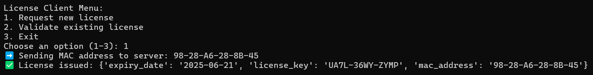
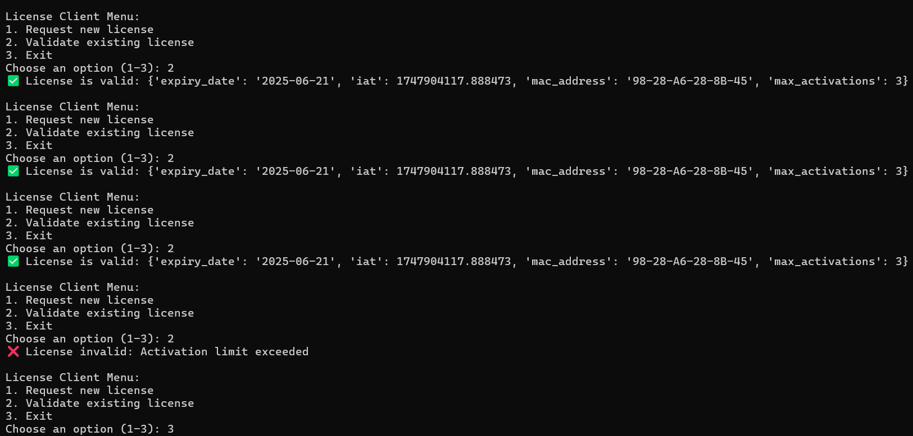

# License Project

A secure, hardware-locked license key generation and validation system built with Python Flask, JWT tokens with RSA encryption, and SQLite database. This system provides robust license management with MAC address binding, activation limits, license renewal control, and comprehensive logging.

---

## 🚀 Features

* **Hardware-Locked Licensing:** License issuance tied to client MAC addresses for enhanced security
* **JWT-Based Authentication:** Secure license tokens signed with RSA (RS256) encryption
* **Activation Management:** License expiry and activation limits enforcement
* **License Renewal:** Server-controlled license renewal (clients cannot renew licenses themselves)
* **HTTPS Security:** Secure API communication with self-signed certificates
* **Comprehensive Logging:** Detailed activation logs and audit trails
* **License Revocation:** Support for revoking and managing licenses
* **User-Friendly Client:** Interactive command-line client application

---

## 🏗️ System Architecture

```
license-project/
├── Server/
│   ├── cert.pem              # SSL certificate
│   ├── key.pem               # SSL private key
│   ├── private_key.pem       # RSA private key for JWT signing
│   ├── public_key.pem        # RSA public key for JWT verification
│   ├── license_server.py     # Main Flask server application
│   ├── generate_keys.py      # Script to generate RSA keys & certificates
│   ├── setup_db.py           # Database initialization script
│   ├── licenses              # SQLite database file
│   └── openssl_cert.cnf      # OpenSSL configuration file
├── Client/
│   ├── license_client.py     # Client application
│   └── cert.pem              # Copy of server certificate
├── images/                   # Screenshots for documentation
├── requirements.txt          # Python dependencies
└── README.md                 # This file
```

---

## 📋 Prerequisites

* Python 3.7 or higher
* pip (Python package installer)
* OpenSSL (for certificate generation)

---

## 🛠️ Installation

### 1. Clone the Repository

```bash
git clone https://github.com/yourusername/license-project.git
cd license-project
```

### 2. Install Dependencies

```bash
pip install -r requirements.txt
```

### 3. Generate Project Keys and Certificates

```bash
cd Server
# Generate RSA keys and SSL certificates
python generate_keys.py

# Initialize the database
python setup_db.py
```

**Manual Setup (Alternative):**

```bash
# Generate RSA key pair
openssl genrsa -out private_key.pem 2048
openssl rsa -in private_key.pem -pubout -out public_key.pem

# Generate SSL certificate
openssl req -x509 -newkey rsa:4096 -keyout key.pem -out cert.pem -days 365 -nodes
```

---

## 🚀 Getting Started

### Server Setup

Run the server with:

```bash
python license_server.py
```

**Note:**

* The server listens **on port 443** with HTTPS enabled by default (you can change this in the source code or via environment variables).
* Access it at: `https://localhost:443`

### Client Setup

1. Update the server IP and port in `license_client.py`:

```python
SERVER_IP = "your_server_ip"
PORT = 443
```

2. Copy `cert.pem` from the server folder to the client folder.

3. Run the client application:

```bash
python license_client.py
```

---

## 📖 Usage

### Client Operations

The client offers an interactive menu:

* **Request New License** (Option 1)
  Validates MAC address, requests a new JWT license token.

* **Validate Existing License** (Option 2)
  Checks license validity, expiration, and activation limits.

* **Exit Application** (Option 3)

### API Endpoints

| Endpoint            | Method | Description                                                          |
| ------------------- | ------ | -------------------------------------------------------------------- |
| `/request-license`  | POST   | Request new license for a MAC address                                |
| `/validate-license` | POST   | Validate existing license token                                      |
| `/revoke-license`   | POST   | Revoke a specific license                                            |
| `/renew-license`    | POST   | **(Server-only)** Renew an existing license (not exposed to clients) |

---

## 🔧 Configuration

### Server Configuration

Add or modify in `config.py`:

```python
HOST = '0.0.0.0'
PORT = 443
SSL_CERT = 'cert.pem'
SSL_KEY = 'key.pem'

DATABASE_PATH = 'licenses.db'

DEFAULT_LICENSE_DURATION = 365  # days
MAX_ACTIVATIONS_DEFAULT = 3
```

### Environment Variables (optional)

```bash
export FLASK_ENV=production
export LICENSE_SERVER_HOST=0.0.0.0
export LICENSE_SERVER_PORT=443
```

---

## 📊 Database Schema

Three main tables:

* **valid\_macs:** Authorized MAC addresses
* **licenses:** License details (expiry, activations, revocation)
* **activations\_log:** Activation attempt logs

Run `python setup_db.py` to initialize.

---

## 🔒 Security Features

* RSA-256 JWT signing
* HTTPS with SSL/TLS encryption
* Hardware-locked licenses (MAC binding)
* Activation limits enforcement
* Audit logging of license use
* Server-controlled license renewal (clients cannot renew licenses themselves)

---
## 📷 Screenshots

**License Request Success**


**License Validation Success**



---

## ⚠️ Troubleshooting

* **SSL Certificate Errors:**
  Regenerate certificates with OpenSSL commands shown above.

* **Database Issues:**
  Remove `licenses.db` and re-run `setup_db.py`.

* **MAC Address Detection:**
  Use Python's `uuid` module to find your MAC if needed.

---

## 👨‍💻 Author

**Shreyaa Kudremane**
GitHub: [@shreyaakudremane](https://github.com/ShreyaaSMKud)
LinkedIn: [Shreyaa Kudremane](https://www.linkedin.com/in/shreyaa-kudremane-75a997219/)
Email: [shreyaa.kudremane@email.com](mailto:shreyaa.kudremane@gmail.com)

---

